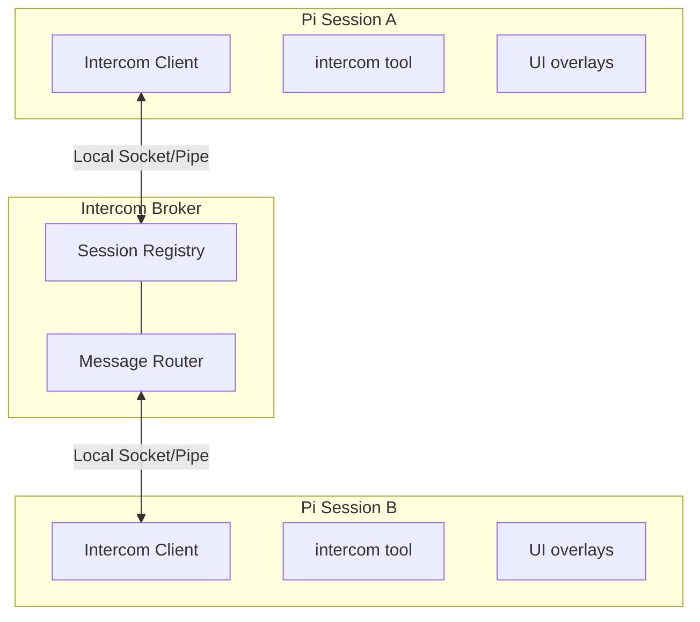

# Intercom

Direct 1:1 messaging between pi sessions on the same machine. Send context, findings, or requests from one session to another — whether you're driving the conversation or letting agents coordinate.

```text
User flow: press Alt+M or run /intercom to pick a session and send a message
```

## Why

Sometimes you're running multiple pi sessions — one researching, one executing, one reviewing. Pi-intercom lets you:

- **User-driven orchestration** — Send context or findings from your research session to your execution session
- **Agent collaboration** — An agent can reach out to another session when it needs help or wants to share results
- **Session awareness** — See what other pi sessions are running and their current status

Unlike pi-messenger (a shared chat room for multi-agent swarms), pi-intercom is for targeted 1:1 communication where you pick the recipient.

Intercom is bundled with `pi-subagents`: delegated child agents get a child-only `contact_supervisor` tool when the subagent extension supplies bridge metadata. Use blocking `need_decision` or `interview_request` only when the ephemeral child cannot safely continue and must remain alive for the reply. Use `progress_update` only for a concise material update that may intentionally wait behind active supervisor work. Normal sessions only see the regular `intercom` tool.

## In One Minute

Each Pi session with the bundled intercom extension loaded connects to a tiny local broker over a local IPC transport. The broker keeps track of connected sessions and routes direct messages to the one you target by name or session ID. The extension gives you both a tool (`intercom`) and a small overlay UI (`/intercom` or `Alt+M`). Messages that do not request a reply default to steer: they wake idle recipients and reach active recipients after the current tool call. Explicit queue waits behind active work, and passive delivery is a discouraged opt-in for human-visible breadcrumbs only.

## Install

```bash
pi install git:github.com/fitchmultz/pi-subagents
```

That one package includes both extension entries and both skills. For local development, install the checkout with `pi install /absolute/path/to/pi-subagents`. Use Pi 0.84.0 or later, then reload existing sessions.

## Development

```bash
npm run ci
npm run smoke:real-pi
```

`ci` runs typechecking, package and install smokes, and the full subagent/intercom test suite. `smoke:real-pi` installs the single checkout into an isolated temporary Pi home, verifies `pi list`, and loads both bundled extension entries. For live model-backed status/list checks, run:

```bash
PI_REAL_SMOKE_MODEL=openai-codex/gpt-5.6-sol npm run smoke:real-pi -- --llm
```

The `--llm` mode copies local `auth.json` and `models.json` into the isolated Pi agent dir. Set `PI_REAL_SMOKE_AUTH_AGENT_DIR` if your auth files are not in `~/.pi/agent`.

Pi-intercom automatically gives ordinary agents a bounded presence hint when another connected session is working in the same Git repository, including separate worktrees. The hint is a constant count-free string; agents still use `intercom({ action: "list" })` for current targets, and no message is sent automatically. Managed `pi-subagents` children keep their dedicated supervisor channel instead of receiving the peer hint. Project matching is an advisory presence signal, not an authorization boundary. Add project instructions only when you want a stricter mandatory coordination policy.

A session becomes intercom-connected when all of these are true:
- the bundled intercom extension is enabled through `pi config`
- the session has started or reloaded after the extension was installed
- the local broker is running or can be auto-started

The session list only shows intercom-connected sessions, not every open Pi process on the machine. Reconnecting the same Pi session reuses a stable broker identity, so transient broker or extension restarts do not create a second logical sender.

If a session is unnamed, pi-intercom now exposes a runtime-only fallback alias like `subagent-chat-1a2b3c4d` so other sessions can still target it. That alias is not persisted as the Pi session title, so `pi --resume` can keep showing the transcript snippet instead of a generic `session-...` name.

## Quick Start

### From the Keyboard

Press **Alt+M** or type `/intercom` to open the session list overlay:

1. **Select a session** — Use arrow keys to pick a target session
2. **Compose message** — Write your message in the compose overlay. Pasted multiline handoffs are preserved.
3. **Choose mode** — Press Tab to toggle between Send and Request Reply mode. Request Reply marks the message as needing a reply and adds the recipient reply hint; the overlay itself does not wait for or collect that reply.
4. **Send** — Press Enter to send, Escape to cancel

### From the Agent

The agent can list sessions and send messages using the `intercom` tool. Tool calls and results render as compact transcript rows so send/ask/reply flows are easy to scan. Successful `list` results show only the session count by default in the TUI; press Ctrl+O (or the configured tool-expansion key) to show the full list. For common patterns like planner-worker delegation, the bundled `pi-intercom` skill provides copy-paste ready examples:

```typescript
// List active sessions
intercom({ action: "list" })
// → **Current session:**
// → • executor (20d43841) — ~/projects/api (claude-sonnet-4) [self, idle, state:idle, accepts_asks:true, pending_asks:0, last_intercom_activity:none]
// →   ↳ self target unavailable; choose a peer from Other sessions; use pending/reply for inbound asks
// → **Other sessions:**
// → • research (6332faab) — ~/projects/api (claude-sonnet-4) [same cwd, thinking, state:busy, accepts_asks:false, pending_asks:1, last_intercom_activity:2m ago]
// →   ↳ send defaults to steer; ask only if sender must stay alive for a required reply (default returns peer_idle); queue only for intentional delay; passive discouraged

// Send live guidance without blocking this long-lived session; send defaults to steer
intercom({ action: "send", to: "research", message: "Check if UserService.validate() handles null. Send the finding back." })
// → Message sent to research. This session can end its turn or continue independent work.

// Check connection status and the same live recipient guidance
intercom({ action: "status" })
// → Connected: Yes, Session ID: abc123, Active sessions: 3
// → Current session and other-session rows follow.

// Send with attachments (code snippets, files, or context)
intercom({
  action: "send",
  to: "worker",
  message: "Here's the fix:",
  attachments: [{
    type: "snippet",
    name: "auth.ts",
    language: "typescript",
    content: "function validate(user: User) { ... }"
  }]
})
```

### Receiving Messages

When a message arrives, it appears inline in your chat with the sender's info. Messages sent with `ask` include a reply hint:

```
**From research** (~/projects/api)

To reply, use the intercom tool: intercom({ action: "reply", message: "..." })

Found the issue — UserService.validate() doesn't check for null input.
See auth.ts:142-156.
```

The reply hint (enabled by default) points to `intercom({ action: "reply", ... })`, so recipients do not need raw sender or `replyTo` IDs. `send` and `reply` default to steer: they wake an idle recipient or reach a busy recipient at the next tool boundary. If the recipient hits Esc before consuming a steered or follow-up message, it is re-delivered after the turn settles. Past 100 unconsumed leftovers in one turn, only the newest are re-delivered. An omitted `ask` still honors recipient availability; use explicit steer only when the sender must remain alive for a busy recipient's reply. The recipient should incorporate relevant context and continue its active task unless the message explicitly replaces it. Use `delivery:"queue"` only when delay is intentional; `queueMode:"replace"` keeps only the latest undelivered thread update. The bounded recipient queue rejects overload explicitly instead of silently dropping an already accepted message. Attachment content is included in the agent-visible body and stored in Pi session history. Only passive `send` renders without waking the recipient model.

## Workflow: Planner-Worker Coordination

The most natural use of pi-intercom is splitting a task between two sessions — one holds the big picture, the other does the hands-on work. When the worker hits an ambiguity, it steers the planner without losing context or blocking its long-lived session.

### Setup

Open two terminals and start pi in each. Name them so they can find each other:

```
# Terminal 1                    # Terminal 2
/name planner                   /name worker
```

Verify they see each other from either session:

```typescript
intercom({ action: "list" })
// → • worker — ~/projects/api (claude-sonnet-4) [idle]
```

### The Conversation

Long-lived Pi sessions normally coordinate without blocking each other. The sender uses `send`, which steers by default, and ends its turn or continues independent work. The recipient sees the message at its next tool boundary, incorporates relevant context, continues the active task, and sends any answer back with steer. A steer supplements the task unless it explicitly says to replace it.

**Planner delegates work:**
```typescript
intercom({
  action: "send",
  to: "worker",
  delivery: "steer",
  message: "Task-3: Add retry logic to API client. Key files: src/api/client.ts, src/api/types.ts."
})
```

**Worker steers a live discovery without holding its process open:**
```typescript
intercom({
  action: "send",
  to: "planner",
  delivery: "steer",
  message: "Blocked: should retry apply only to idempotent endpoints? Send the decision back with steer."
})
// Worker ends its turn instead of polling or waiting.
```

**Planner answers while preserving the worker's active task:**
```typescript
intercom({
  action: "send",
  to: "worker",
  delivery: "steer",
  message: "Apply retries only to GET/PUT/DELETE. Max 3, exponential backoff from 100ms. Continue the current task."
})
```

**Worker reports completion:**
```typescript
intercom({
  action: "send",
  to: "planner",
  delivery: "steer",
  message: "Task-3 done. Added RetryPolicy, applied it to GET/PUT/DELETE, surfaced NetworkError, and passed 4 tests."
})
```

### Communication Patterns

| Pattern | Action | Why |
|---------|--------|-----|
| **Task Delegation** | `send` + steer | Wakes an idle worker or reaches a busy worker at the next tool boundary without blocking the planner. |
| **Guidance / Answer** | `send` + steer | Makes relevant context available during active work. |
| **Clarification / Blocker** | `send` + steer | Long-lived peers can end their turn and wake when the answer arrives. |
| **Intentional Deferral** | `send` + queue | The recipient should not incorporate the note until after active work. |
| **Ephemeral Blocking Wait** | `ask` + steer | Keeps a short-lived process alive only when it cannot safely continue without the reply. |

### Blocking Ask Exception

Use `ask` only when the sender process must remain alive and cannot safely continue without the answer, such as an ephemeral dispatched subagent. Pass `delivery:"steer"` so the question reaches a busy recipient at its next tool boundary. The recipient answers with `intercom({ action: "reply", message: "..." })`; `pending` recovers unresolved asks when needed.

### `send` vs `ask`

`send` is the default for agent-to-agent coordination and uses steer when `delivery` is omitted. It wakes idle recipients or reaches busy recipients at the next tool boundary, then returns after broker acceptance. Use explicit queue only when delay is intentional, and passive only for human-visible breadcrumbs. If you want approval before non-reply sends, set `confirmSend: true`.

`ask` sends and waits up to `askTimeoutMs` (default 2 minutes). Reserve `ask` plus steer for a sender process that must remain alive and cannot safely continue without the answer. Long-lived peers should use `send` plus steer and end their turn instead. A default ask to a peer publishing `accepts_asks:false` returns promptly with `reason:"peer_idle"`; an explicit steer ask keeps waiting.

`reply` answers an inbound ask using its exact sender and message automatically. Otherwise, answer ordinary coordination with `send` plus steer. If multiple asks are pending, use `pending` and disambiguate with `to`.

Inbound steers are supplemental coordination inside the active task. Incorporate relevant context and continue; replace the task only when the message explicitly instructs replacement.

## Workflow: Subagent-to-Supervisor Escalation

When this package spawns a Pi-backed delegated child, it supplies bridge metadata that gives the child a subagent-only `contact_supervisor` tool in addition to the regular `intercom` tool. Normal sessions never see `contact_supervisor`; non-Pi child backends such as Claude Code do not load this tool.

### When the Tool Appears

`contact_supervisor` only registers when `pi-subagents` sets all of these environment variables:

- `PI_SUBAGENT_ORCHESTRATOR_TARGET` — the supervisor session name or ID
- `PI_SUBAGENT_RUN_ID` — the run identifier
- `PI_SUBAGENT_CHILD_AGENT` — the agent type
- `PI_SUBAGENT_CHILD_INDEX` — the child index within the run

If any are missing, the session falls back to the regular `intercom` tool. A subagent status line may mention an intercom target before the child is actually registered with pi-intercom; treat `intercom({ action: "list" })` as the source of truth. If the advertised target is absent from `list`, use normal subagent controls (`status`, `resume`, `nudge`, result artifacts) instead of sending to that target; the child may be Claude Code-backed or already exited and have no child-side `contact_supervisor`.

When both bundled extension entries are enabled, parent sessions can use `subagent({ action: "nudge", id: "<run-id>", message: "..." })` to send a non-blocking steered nudge to a live child. `subagent status` may also show the direct blocking `intercom({ action: "ask", to: "...", delivery: "steer", message: "..." })` path; use that exception only when the parent process must remain alive and cannot safely continue without the reply. `pi-intercom` remains the source of truth for connected sessions and only delivers to registered local peers.

### Three Reasons

| Reason | Behavior | Use When |
|--------|----------|----------|
| `need_decision` | Sends a steered ask and keeps the child alive until the supervisor replies (`askTimeoutMs`, default 2 minutes) | The ephemeral child cannot safely continue without one decision, approval, or product/API/scope clarification |
| `interview_request` | Sends a steered structured ask and keeps the child alive until the supervisor replies | The ephemeral child cannot safely continue until it receives multiple structured answers |
| `progress_update` | Non-blocking, deferred/coalesced update to the supervisor | A concise material update may intentionally wait behind active supervisor work |

Do not use `contact_supervisor` for routine completion handoffs. Return the final subagent result normally through `pi-subagents`.

Intercom delivery is for live coordination and grouped completion notices. Durable subagent output still lives in `pi-subagents` result details and artifact/output paths (`savedOutputPath`, `artifactPaths`, or explicit workspace `output` files). If a grouped intercom notice says output was delivered, use it as a notification; use the artifact or explicit output path as the source of truth for long reports.

### Example: Blocked Subagent Asks for Guidance

```typescript
contact_supervisor({
  reason: "need_decision",
  message: "The auth service returns 403 instead of 401 for expired tokens. Should I treat 403 as a re-auth trigger or a hard failure?"
})
// → Reply from supervisor: Treat 403 as re-auth trigger. Update the token refresh logic.
```

### Example: Structured Supervisor Interview

```typescript
contact_supervisor({
  reason: "interview_request",
  message: "Please answer these before I continue the migration.",
  interview: {
    title: "API migration choices",
    questions: [
      { id: "api", type: "single", question: "Which API should I target?", options: ["Stable API", "Experimental API"] },
      { id: "constraints", type: "text", question: "What constraints should I preserve?" }
    ]
  }
})
// → Reply from supervisor: { "responses": [{ "id": "api", "value": "Stable API" }, ...] }
```

### Example: Progress Update

```typescript
contact_supervisor({
  reason: "progress_update",
  message: "Discovered the bug is in the retry wrapper, not the API client. Fixing the wrapper will also close issue #42."
})
// → Progress update sent to supervisor planner
```

### What the Supervisor Sees

The supervisor receives a formatted message with run metadata:

```
**From subagent-worker-78f659a3-1**

Subagent needs a supervisor decision.
Run: 78f659a3
Agent: worker
Child index: 0

Which API should I use?
```

Reply hints work the same as regular `intercom` ask/reply flows. The supervisor can reply with `intercom({ action: "reply", message: "..." })` and the subagent receives the answer as the tool result. If the parent agent is busy and later needs to recover the request, `intercom({ action: "pending" })` summarizes supervisor asks with run id, agent, child target, and question text.

For `interview_request`, the supervisor message includes the structured questions plus a fenced JSON answer example using this stable shape:

```json
{
  "responses": [
    { "id": "api", "value": "Stable API" },
    { "id": "constraints", "value": "Keep the public error shape unchanged." }
  ]
}
```

The supervisor can reply with plain JSON or a fenced `json` block. If the reply matches the `{ "responses": [...] }` shape and references valid question ids/options, the child tool result includes it in `details.structuredReply` while still showing the raw reply text.

## Tool Reference

### intercom

| Parameter | Type | Description |
|-----------|------|-------------|
| `action` | string | `"list"`, `"send"`, `"ask"`, `"reply"`, `"pending"`, or `"status"` |
| `to` | string | Target session name or ID (for send/ask, or to disambiguate reply) |
| `message` | string | Message text (for send/ask/reply) |
| `attachments` | array | Optional `file`, `snippet`, or `context` attachments |
| `replyTo` | string | Optional message ID for threading or replying to an `ask` |
| `delivery` | string | Optional: omitted `send` defaults to `"steer"`, which injects after the current tool call; `"queue"` intentionally waits behind active work, and `"passive"` does not wake the recipient model (`send` only). |
| `queueMode` | string | Optional with queued delivery: `"stack"` keeps all messages, `"replace"` keeps only the latest undelivered message for the same `threadId` after a short coalescing window. |
| `threadId` | string | Required for `queueMode:"replace"`; stable topic key for replacement. |
| `passive` | boolean | Legacy `send`-only alias for `delivery:"passive"`. Discouraged for agent-to-agent messages. |

### contact_supervisor

Only registered in sessions where `pi-subagents` supplied the required child bridge metadata. Contacts the supervisor session that delegated the current task.

| Parameter | Type | Description |
|-----------|------|-------------|
| `reason` | string | `"need_decision"` (blocking), `"interview_request"` (blocking structured questions), or `"progress_update"` (non-blocking) |
| `message` | string | The decision request, optional interview note, or progress update |
| `interview` | object | Required for `interview_request`: `{ title?, description?, questions: [...] }` |

**`need_decision`** — Use only when the ephemeral child cannot safely continue without one decision, approval, or product/API/scope clarification. It sends a formatted steered ask to the supervisor and keeps the child alive until the reply arrives (`askTimeoutMs`, default 2 minutes). The reply comes back as the tool result. Includes run metadata in the message so the supervisor knows which subagent is asking.

**`interview_request`** — Use only when the ephemeral child cannot safely continue until it receives multiple structured answers. It sends a formatted, steered agent-readable interview to the supervisor and keeps the child alive until the reply arrives. Questions use a local pi-interview-like shape: `{ id, type, question, options?, context? }` where `type` is `single`, `multi`, `text`, `image`, or `info`. `info` questions are context-only and do not need responses. The supervisor reply should be JSON with `{ "responses": [{ "id": "...", "value": ... }] }`. Parsed JSON replies are returned in `details.structuredReply`.

**`progress_update`** — Sends a non-blocking update through intentionally deferred, replace-mode delivery. Returns immediately after broker acceptance. Use only for a concise material update that may wait behind active supervisor work.

### intercom actions

**`list`** — Returns the current session plus other active intercom-connected sessions with name, safe target, working directory, model, live status, and peer health tags: `state` (`idle`, `busy`, or `unknown`), `accepts_asks`, `pending_asks`, `last_intercom_activity`, and `last_seen`. Peer rows include live delivery guidance for `ask`, `send`, `queue`, `steer`, and the discouraged passive path; the self row says self-target delivery is unavailable and points to peer targets / `pending` / `reply`. Status is derived automatically from Pi lifecycle events: `idle`, `thinking`, or `tool:<name>`. If multiple sessions have the same name, use the displayed target exactly as shown, for example `to: "ca7bfec2"`. The target may be longer than eight characters when needed to avoid collisions.

**`send`** — Sends a non-blocking, default-steered message to the specified session and returns broker acceptance, not a later response. It wakes idle recipients or reaches busy recipients at the next tool boundary. Use `delivery:"queue"` only when delay is intentional, and `delivery:"passive"`/`passive:true` only for human-visible breadcrumbs. `queueMode:"replace"` with a `threadId` replaces older undelivered intercom-staged messages for that thread after a short coalescing window; once a message is handed to Pi's native queue it cannot be keyed-replaced. Set `confirmSend: true` in config if you want a confirmation dialog for non-reply sends. Replies that include `replyTo` skip confirmation.

**`ask`** — Sends a message and waits for the recipient to reply (`askTimeoutMs`, default 2 minutes). Reserve it for a sender process that must remain alive and cannot safely continue without the answer; use `delivery:"steer"` so a busy recipient sees it at the next tool boundary. If the target publishes `accepts_asks:false`, a default blocking ask returns promptly with `reason:"peer_idle"`, while an explicit steer ask still waits. Only one pending waiting ask is allowed per session. Passive delivery is rejected.

**`reply`** — Replies to the current intercom-triggered message if there is one. Otherwise it falls back to the single unresolved inbound ask. If multiple asks are pending, pass `to` or inspect them with `pending` first. Under the hood this is still a normal `send` with the exact `replyTo` value.

**`pending`** — Lists unresolved inbound asks with sender, elapsed time, a labeled `replyTo` ID, and a copy-ready `intercom({ action: "reply", ... })` call. For `pi-subagents` supervisor asks, the preview expands the run id, agent, child intercom target, and question so the parent can reply without guessing. Useful when replying after the original triggered turn.

**`status`** — Shows connection status, session ID, total active sessions, and the same live recipient capability rows as `list` so agents can choose `ask`, `queue`, `steer`, or avoid passive delivery without a second call.

## Keyboard Shortcuts

| Key | Action |
|-----|--------|
| Alt+M | Open session list overlay |
| ↑/↓ | Navigate session list |
| Tab | Toggle Send / Request Reply mode in the compose overlay |
| Enter | Select session / Send or ask |
| Escape | Cancel / Close overlay |

## Config

Create `${PI_CODING_AGENT_DIR:-~/.pi/agent}/intercom/config.json`:

```json
{
  "confirmSend": false,
  "replyHint": true,
  "askTimeoutMs": 120000,
  "sendTimeoutMs": 8000,
  "listTimeoutMs": 5000,
  "status": "researching"
}
```

| Setting | Default | Description |
|---------|---------|-------------|
| `brokerCommand` | current Node executable | Command used to start the local broker process when you override the default |
| `brokerArgs` | `[]` | Arguments passed to `brokerCommand` before the broker script path. The built-in default runs the bundled TypeScript broker directly with Node. |
| `confirmSend` | false | Show a confirmation dialog before non-reply sends from an interactive session with UI |
| `replyHint` | true | Include reply instructions in incoming asks |
| `askTimeoutMs` | `120000` | Reply wait timeout for `ask` and blocking supervisor requests |
| `sendTimeoutMs` | `8000` | Broker delivery-ack timeout for sends/asks |
| `listTimeoutMs` | `5000` | Session-list response timeout |
| `status` | — | Optional custom status suffix shown after the automatic lifecycle status, for example `thinking · researching` |

Use `pi config` to enable or disable the bundled intercom extension. The former `config.json` `enabled` key is no longer read; in particular, an existing `"enabled": false` does not disable intercom after this migration.

For example, if you have Bun installed and want it to start the broker directly, use:

```json
{
  "brokerCommand": "bun",
  "brokerArgs": []
}
```

Pi-intercom publishes live session status automatically. Sessions register as `idle`, switch to `thinking` while the agent is running, show `tool:<name>` during tool execution, and return to `idle` on agent completion. If `status` is set in config, it is appended as context instead of replacing the lifecycle status.

## How It Works



The broker is a standalone TypeScript process that manages session registration and message routing. It auto-spawns when the first intercom session needs it and exits after 5 seconds when the last connected session disconnects. Clients now reconnect automatically if the broker disappears and later comes back.

Messages use length-prefixed JSON over a local socket/pipe transport (4-byte length + JSON payload) to handle fragmentation properly. The protocol includes request correlation for session listing, explicit delivery failures, and validation for malformed or out-of-order messages. Session registration carries user-facing identity plus live health fields; process ID, start time, and the redundant activity timestamp are no longer part of the protocol.

Async extension work (startup, inbound flushes, reconnects, overlays, and relays) no-ops if the session shuts down or reloads before it settles.

Runtime files:
- Unix domain socket — short temp path named `pi-intercom-<hash>.sock` on macOS/Linux, keyed by `PI_CODING_AGENT_DIR` or `~/.pi/agent`; Windows uses a named pipe instead
- `${PI_CODING_AGENT_DIR:-~/.pi/agent}/intercom/broker-launch.vbs` — Windows helper script used to launch the broker without a console window
- `${PI_CODING_AGENT_DIR:-~/.pi/agent}/intercom/broker.pid` — Broker process ID
- `${PI_CODING_AGENT_DIR:-~/.pi/agent}/intercom/config.json` — User configuration

## Design Decisions

**Local IPC instead of TCP.** Same-machine only by design. `pi-intercom` uses Unix sockets on macOS/Linux and a named pipe on Windows, which keeps setup simple and avoids port management.

**Auto-spawn with file lock.** The broker starts on first connection and exits after 5 seconds idle. There is no daemon to manage. A spawn lock file, keyed by PID and timestamp, prevents duplicate brokers when multiple sessions start at once.

**`ask` stays client-side.** The broker still routes plain messages; it does not have a special request/response mode for `ask`. The sender marks the message as expecting a reply, the recipient wakes or queues according to the delivery mode, and the sender waits for the matching reply before returning it as the tool result. Reply hints make that flow practical by showing the recipient the exact `reply` call to use. Separately, `list` / `sessions` now carry a `requestId` so a delayed session-list reply cannot be mistaken for a newer one.

## pi-intercom vs pi-messenger

| Aspect | pi-intercom | pi-messenger |
|--------|-------------|--------------|
| **Model** | Direct 1:1 messaging | Shared chat room |
| **Primary use** | User orchestrating sessions | Autonomous agent coordination |
| **Discovery** | Broker-based (real-time) | File-based registry |
| **Messages** | Private, session-to-session | Broadcast to all agents |
| **Persistence** | In Pi session history | Shared coordination files |

Use pi-messenger for multi-agent swarms working on a shared task. Use pi-intercom when you want to manually coordinate your own sessions or have one agent reach out to another specific session.

## File Structure

```
pi-subagents/
├── package.json          # One manifest for both extensions
├── src/pi-intercom/
│   ├── index.ts          # Intercom extension entry point
│   ├── types.ts          # SessionInfo, Message, protocol types
│   ├── config.ts         # Config loading
│   ├── broker/
│   │   ├── broker.ts         # Broker process
│   │   ├── client.ts         # IntercomClient class
│   │   ├── framing.ts        # Length-prefixed JSON protocol
│   │   ├── paths.ts          # Platform-specific socket/pipe paths
│   │   └── spawn.ts          # Auto-spawn logic with lock file
│   └── ui/
│       ├── session-list.ts   # Session selection overlay
│       ├── compose.ts        # Message composition overlay
│       └── inline-message.ts # Received message display
└── skills/pi-intercom/
    └── SKILL.md              # Bundled skill for common patterns
```

## Limitations

- **Same machine only** — Uses local sockets/pipes, no network support
- **No dedicated intercom log** — Messages are kept in Pi session history, but there is no separate intercom transcript or inbox
- **No attachments UI** — `file`, `snippet`, and `context` attachments are supported in the protocol, but not in the compose overlay
- **Only connected sessions appear** — The list shows Pi sessions that have loaded `pi-intercom` and successfully registered with the broker, not every open Pi process on the machine
- **Broker lifecycle** — The broker auto-spawns on first use and exits when idle; sessions reconnect automatically if the broker restarts
